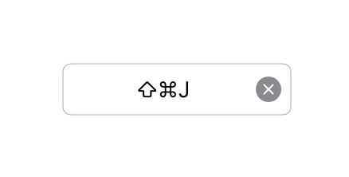

# Keyboard Shortcut Recorder for UIKit

This is a custom control making it easy for record a keyboard shortcut for use with a UIKeyCommand. It is primarily intended for use on iPad. It also works on iPhone.



A sample project demonstrating this is [available in a separate repository](https://github.com/jbrayton/KeyboardShortcutRecorderSample).

This project is heavily inspired by [KeyboardShortcuts](https://github.com/sindresorhus/KeyboardShortcuts) by [Sindre Sorhus](https://sindresorhus.com/), a library that performs a similar function for macOS. There are some code snippets directly copied from KeyboardShortcuts (with a copy of its license agreement). [Unread](https://www.goldenhillsoftware.com/unread/) uses [KeyboardShortcuts](https://github.com/sindresorhus/KeyboardShortcuts) on macOS, and this library on iPadOS.

## Getting started

### 1. Incorporate via Swift Package Manager.

The GitHub URL is [https://github.com/jbrayton/KeyboardShortcutRecorderForUIKit](https://github.com/jbrayton/KeyboardShortcutRecorderForUIKit).

### 2. Implement `KEYKeyboardFieldDelegateType`.

```swift
public protocol KEYKeyboardFieldDelegateType : NSObject {
    
    // Should return true if allowed, false if not. The caller is responsible for
    // giving the user and error message or a warning if returning false.
    // This is asynchronous so that the caller can present an alert that lets the user
    // override a warning.
    //
    // This library assumes that setting the shortcut to nil (clearing the shortcut) is
    // always valid, and therefore that calling `setShortcut(shortcut: nil)` always returns
    // true.
    func setShortcut( shortcut: KEYKeyboardShortcut? ) async -> Bool
    
}
```

The caller is responsible for storing and using the shortcut as it sees fit. `KEYKeyboardShortcut` conforms to `Codable`, making it easy to store.

### 3. Create the shortcut field.

Create the shortcut:

```swift
self.keyboardShortcutField = KEYKeyboardShortcutField()
self.keyboardShortcutField.translatesAutoresizingMaskIntoConstraints = false

// If there is a default value.
self.keyboardShortcutField.shortcut = …
self.keyboardShortcutField.shortcutFieldDelegate = self // (or your delegate of choice)
self.view.addSubview(self.keyboardShortcutField)
self.view.addConstraints([
	…
])
```

### 4. Use the shortcut for a UIKeyCommand.

```
override var keyCommands: [UIKeyCommand]? {
	get {
		var result = [UIKeyCommand]()
		if let shortcut = myShortcut {
			let functionKeyCommand = UIKeyCommand(input: shortcut.input, modifierFlags: shortcut.modifierFlags, action: #selector(handleKeyCommand(_:)))
			result.append(functionKeyCommand)
		}
		return result
	}
}
```

These are just code snippets. A [fully-functional sample project is available](https://github.com/jbrayton/KeyboardShortcutRecorderSample).

## Notes:

- The control handles light mode and dark mode reasonably by default.
- You can specify your own colors for the text, placeholder text, etc.
- By default, the initial font is `UIFont.systemFont(ofSize: UIFont.systemFontSize)`. The control does not resize itself based on dynamic type size settings. The application is responsible for changing the control’s `font` value when the type size changes.

## Limitations:

- This deliberately only works with a hardware keyboard. Giving this control keyboard focus will not result in the software keyboard appearing.
- The control’s default color scheme looks good, but the colors are not completely consistent with the default colors of a UITextField.

## Notes:

- Using function keys as UIKeyCommands does not appear to work on iPadOS. I filed `FB15095501`. This control will not reject them. I recommend rejecting them in your `KEYKeyboardFieldDelegateType` implementation.
